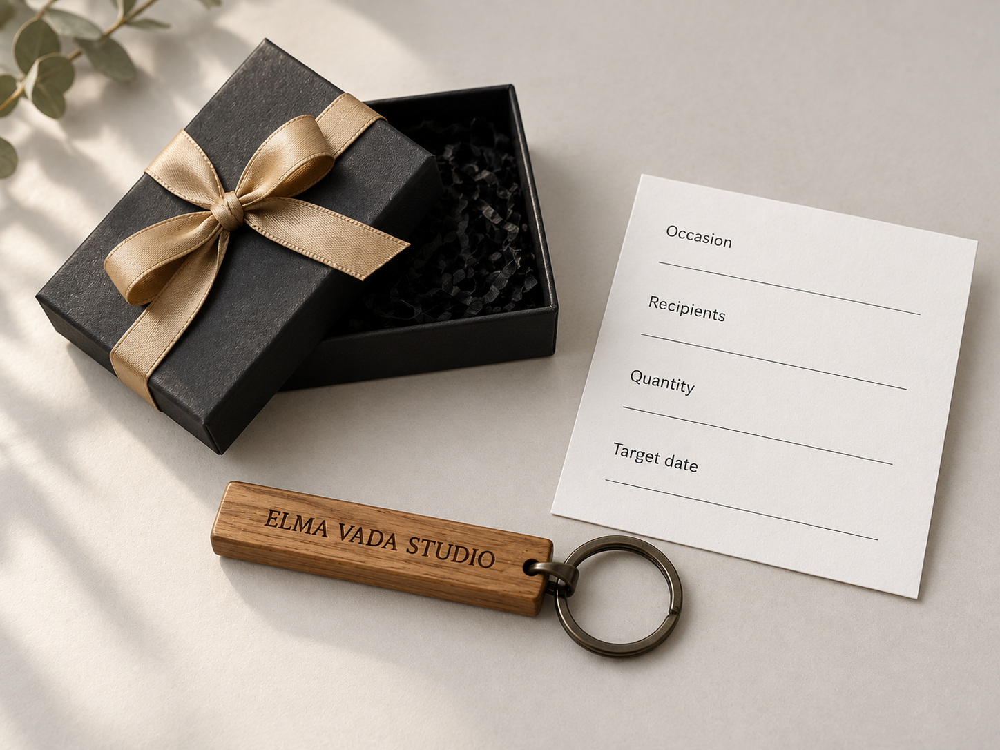
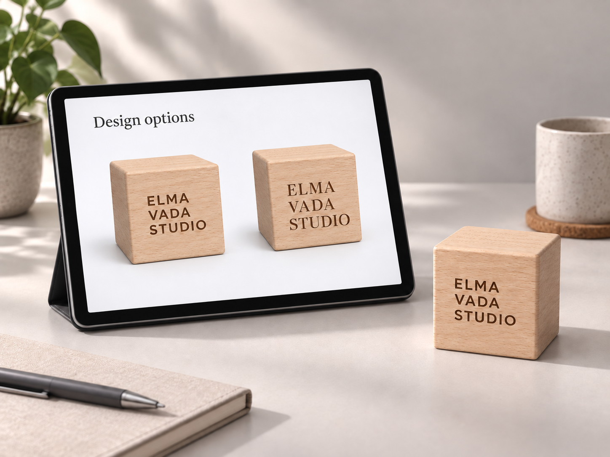
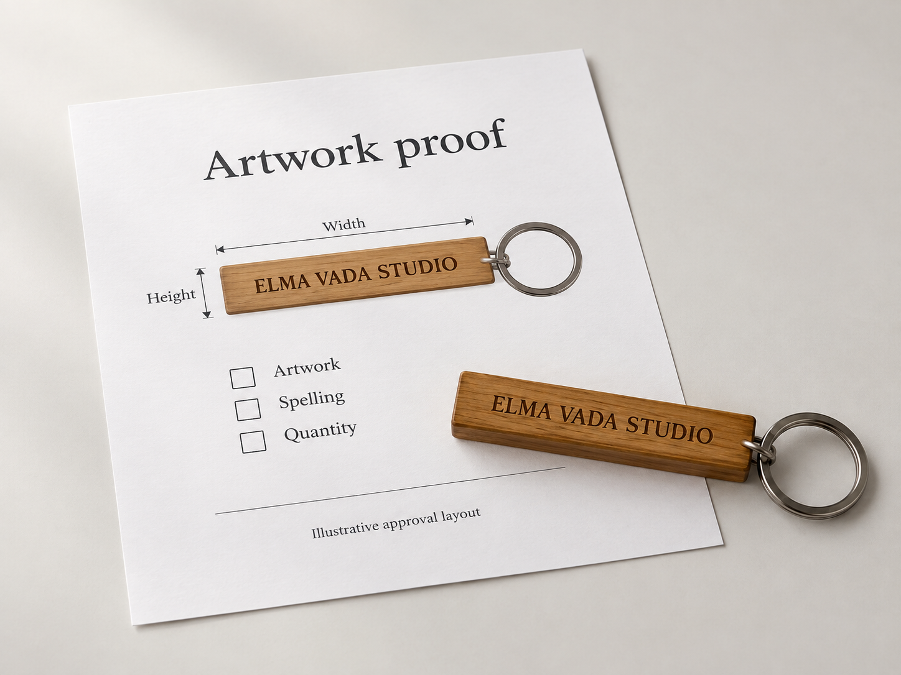
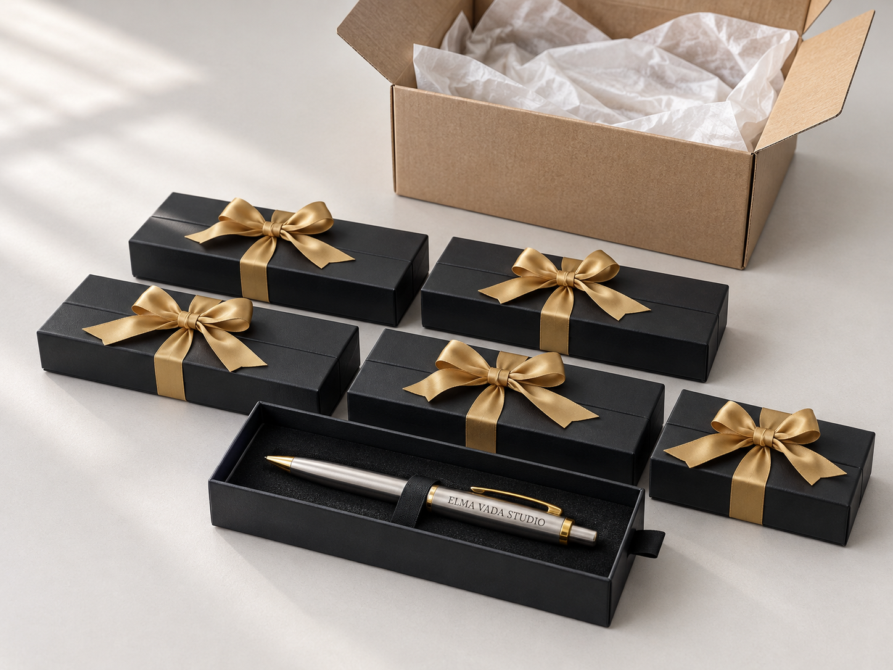
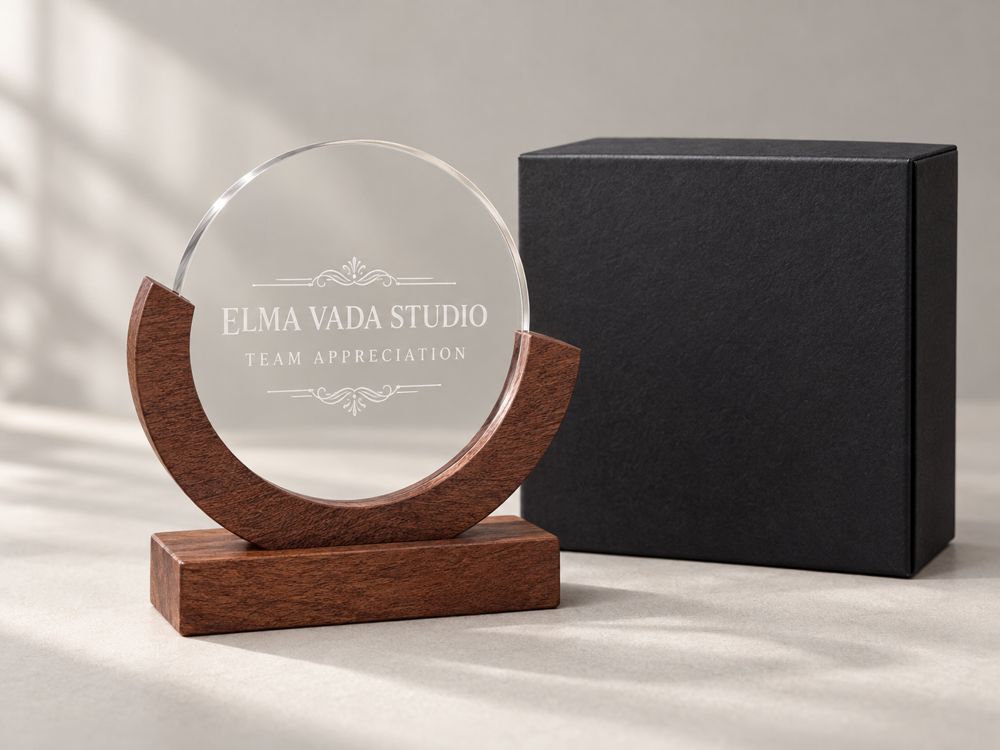
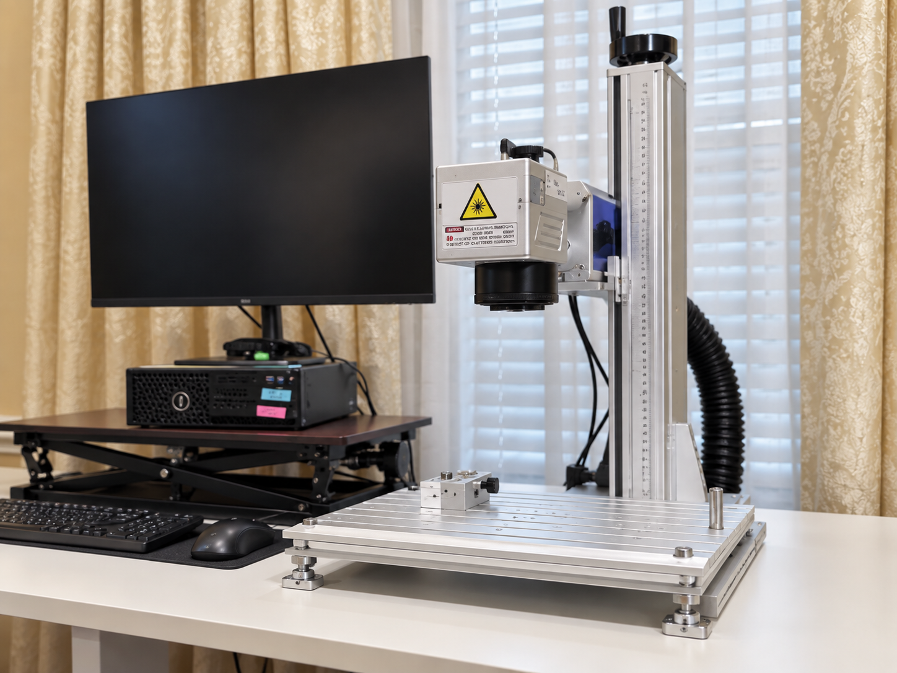
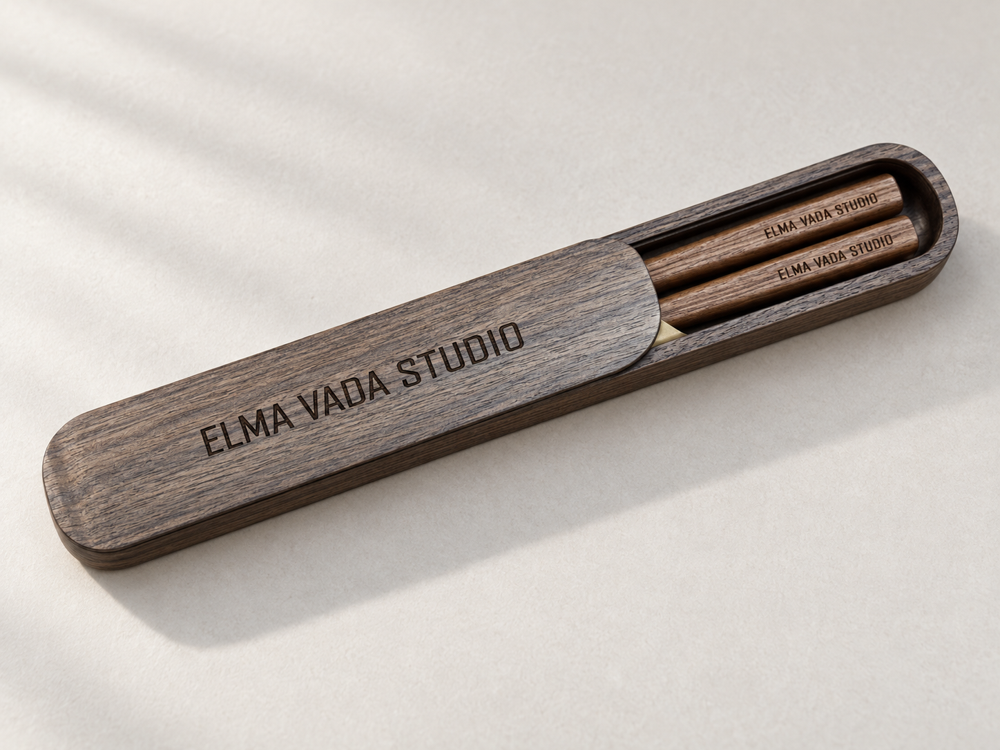

# Personalized Merchandise — новые изображения

Создано 27 сентября 2026 встроенным imagegen: **12 PNG, 1448 × 1086 px, 4:3**.
Имена начинаются с `google-ai-photo` для удобного поиска по запросу пользователя; это не название использованного генератора.

[Инструкция страницы](../../../docs/page-media/10-personalized-merchandise.md) · [Alt-тексты CSV](alt-texts.csv) · [Промпты и соответствие полям](prompts.json).

## Что куда ставить

Первые 5 файлов — основные изображения. Файлы 06–12 — дополнительные: в этих карточках нужно включить **Include image or video**. Header / Footer сохраняют существующий логотип; FAQ и финальный CTA не имеют медиаполей.

Это визуальные AI-концепты. Для товарных сцен видимая подпись: `Illustrative product concept`; для студии: `Illustrative studio view`. Изображения упаковки и оборудования не являются документальной съёмкой выполненного заказа. Drinkware — концепт по прежнему иллюстративному референсу; наличие конкретной модели не подтверждено.

Alt на английском описывает изображение; отдельного SEO/AEO-варианта не требуется. Не включайте служебный префикс файла в alt.

### 01. Hero

Файл: [google-ai-photo-01-personalized-merchandise-hero.png](google-ai-photo-01-personalized-merchandise-hero.png)  
Shopify: `hero` · Основное изображение.

Награда, деревянный кубик, ручка и палочки в футляре — общий кадр разных товаров.

Alt: `Personalized pen, wooden desk cube, chopsticks in a case and circular award displayed together.`

### 02. Everyday Pens

Файл: [google-ai-photo-02-everyday-pens.png](google-ai-photo-02-everyday-pens.png)  
Shopify: `examples.item_1` · Основное изображение.

Три серебристые ручки с золотистыми деталями и гравировкой ELMA VADA STUDIO.

Alt: `Three silver-tone pens with gold-tone clips and Elma Vada Studio engraving.`

### 03. Drinkware

Файл: [google-ai-photo-03-drinkware.png](google-ai-photo-03-drinkware.png)  
Shopify: `examples.item_2` · Основное изображение.

Два прозрачных стакана с матовой надписью и растительным мотивом. Концепт стеклянного drinkware, не металлического.

Alt: `Two clear drinking glasses with frosted Elma Vada Studio lettering and a leaf motif.`

### 04. Desk Accessories

Файл: [google-ai-photo-04-desk-accessories.png](google-ai-photo-04-desk-accessories.png)  
Shopify: `examples.item_3` · Основное изображение.

Деревянный настольный кубик с надписями ELMA VADA STUDIO и GROW TOGETHER.

Alt: `Wooden desk cube engraved with Elma Vada Studio and Grow Together.`

### 05. Coordinated Kits

Файл: [google-ai-photo-05-coordinated-kits.png](google-ai-photo-05-coordinated-kits.png)  
Shopify: `examples.item_4` · Основное изображение.

Подарочный пакет, открытая коробка с ручкой, золотая лента и деревянный брелок.

Alt: `Engraved pen in a black gift box beside a wooden keychain, gold ribbon and black gift bag.`

### 06. Share the Brief

Файл: [google-ai-photo-06-share-the-brief.png](google-ai-photo-06-share-the-brief.png)  
Shopify: `process.item_1` · Дополнительно, сейчас текстовая карточка.

Брелок, коробка и карточка с полями Occasion, Recipients, Quantity, Target date.

Alt: `Engraved wooden keychain beside a gift box and a project brief card.`

### 07. Review the Direction

Файл: [google-ai-photo-07-review-the-direction.png](google-ai-photo-07-review-the-direction.png)  
Shopify: `process.item_2` · Дополнительно, сейчас текстовая карточка.

Планшет с двумя вариантами шрифта на кубике и отдельный образец рядом.

Alt: `Tablet displaying two engraving designs for a wooden desk cube beside a matching sample.`

### 08. Approve the Details

Файл: [google-ai-photo-08-approve-the-details.png](google-ai-photo-08-approve-the-details.png)  
Shopify: `process.item_3` · Дополнительно, сейчас текстовая карточка.

Лист согласования гравировки брелока: направления Width и Height, проверка Artwork, Spelling, Quantity. Числовые размеры не заявлены.

Alt: `Illustrative wooden keychain engraving proof with placement guides and an approval checklist.`

### 09. Produce & Prepare

Файл: [google-ai-photo-09-produce-and-prepare.png](google-ai-photo-09-produce-and-prepare.png)  
Shopify: `process.item_4` · Дополнительно, сейчас текстовая карточка.

Пять закрытых коробок с золотыми лентами, открытая коробка с ручкой и картонная упаковка на заднем плане. Иллюстрация комплектации.

Alt: `Black gift boxes with gold ribbons and an open engraved pen box beside a shipping carton.`

### 10. Business Solutions

Файл: [google-ai-photo-10-business-solutions.png](google-ai-photo-10-business-solutions.png)  
Shopify: `related.item_1` · Дополнительно, сейчас текстовая карточка.

Круглая прозрачная награда на деревянной подставке и чёрная коробка.

Alt: `Clear circular Team Appreciation award on a wooden base beside a black presentation box.`

### 11. Production Capabilities

Файл: [google-ai-photo-11-production-capabilities.png](google-ai-photo-11-production-capabilities.png)  
Shopify: `related.item_2` · Дополнительно, сейчас текстовая карточка.

Новая AI-композиция по фото вашей студии: настольный гравировальный аппарат и монитор. Тип лазера не указан.

Alt: `Illustrative studio view of a desktop laser engraving machine and computer monitor.`

### 12. Our Work

Файл: [google-ai-photo-12-our-work.png](google-ai-photo-12-our-work.png)  
Shopify: `related.item_3` · Дополнительно, сейчас текстовая карточка.

Деревянные палочки в частично открытом футляре с надписью ELMA VADA STUDIO. Демонстрационный вариант изделия.

Alt: `Wooden chopsticks in a matching sliding-lid case engraved with Elma Vada Studio.`

## Референсы

Нормализованные копии находятся в `sources/`. Исходные фото не изменялись.

| Копия | Исходник | Роль |
|---|---|---|
| pen.png | ../images/elma-vada-20-real-site-images/engraved-silver-gold-pen-close-up.jpg | Форма серебристой ручки с золотистой клипсой |
| cube.png | ../images/elma-vada-20-real-site-images/engraved-wood-quote-block-keepsake.jpg | Деревянный кубик |
| award.png | ../images/elma-vada-20-real-site-images/custom-recognition-award-wood-acrylic.jpg | Круглая прозрачная награда с деревянной опорой |
| packaging.png | ../images/elma-vada-20-real-site-images/corporate-gift-bag-box-personalized-pen.jpg | Пакет, коробка и золотая лента |
| keychain.png | ../images/elma-vada-20-real-site-images/personalized-wood-keychain-laser-engraved.jpg | Прямоугольный деревянный брелок |
| chopsticks.png | ../images/elma-vada-20-real-site-images/team-epic-engraved-chopsticks-gift-sets.jpg | Палочки и раздвижной футляр |
| drinkware-concept.png | ../images/home/engraved_glass.png | Прежняя иллюстрация стакана, не подтверждённое фото товара |
| studio.png | ../images/capabalities/1.JPG | Фото реального интерьера и оборудования; созданная сцена — иллюстрация |

Пути исходников в таблице указаны относительно корня темы. Сохранённые PNG проверены визуально; у файлов 04 и 07 дополнительно убраны нечёткие надписи на верхних гранях кубиков. Числовые размеры в согласовании макета не выдумывались.

Код темы, шаблоны и опубликованный магазин не изменялись.
