# Promotional Products — изображения с единым фоном

**12 PNG, 1448 × 1086 px, 4:3**: ранее созданный Hero плюс 11 новых изображений. Созданы встроенным imagegen; для каждого нового изображения Hero передан как референс фона и освещения. Награда дополнительно отредактирована для замены прозрачного фона на общий серый.

[Инструкция страницы](../../../docs/page-media/12-promotional-products.md) · [Скачать ZIP](promotional-products-elma-vada-dfw-images.zip) · [Alt-тексты CSV](alt-texts.csv) · [Промпты](prompts.json).

Первые пять изображений — основные. Для семи дополнительных карточек включите **Include image or video**. В Shopify файлы автоматически не загружались.

AI-композиции не являются документальной съёмкой. Подпись для товаров: `Illustrative product concept`; для аппарата: `Illustrative equipment view`. Drinkware — концепт стаканов, наличие модели не подтверждено. Исходные реальные фотографии не изменялись.

## 1. Hero

Ранее созданный Hero — образец общего фона и освещения.

Файл: [engraved-promotional-pens-wooden-keepsakes-elma-vada-dfw.png](engraved-promotional-pens-wooden-keepsakes-elma-vada-dfw.png)  
Поле: `hero` · Основное.

Alt (90 символов): `Silver metal pens, wooden keychains and a wooden desk cube engraved with Elma Vada Studio.`

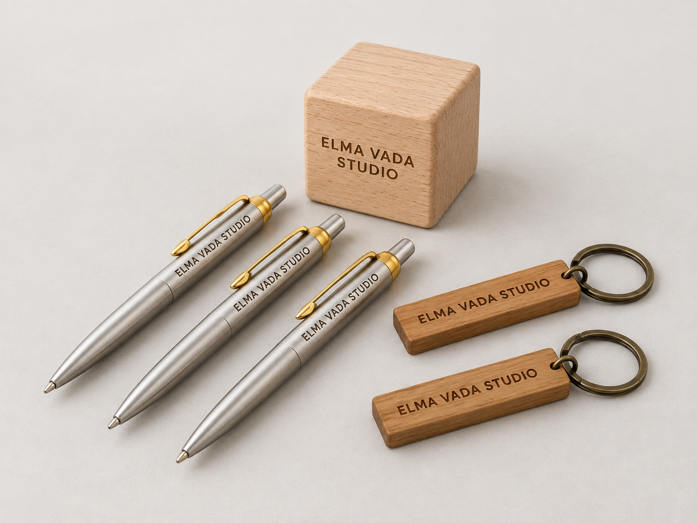

## 2. Event Pens

Пять серебристых ручек с золотистыми клипсами и надписью ELMA VADA STUDIO.

Файл: [silver-event-pen-batch-elma-vada-dfw.png](silver-event-pen-batch-elma-vada-dfw.png)  
Поле: `examples.item_1` · Основное.

Alt (85 символов): `Five silver metal pens with gold-tone clips and matching Elma Vada Studio engravings.`

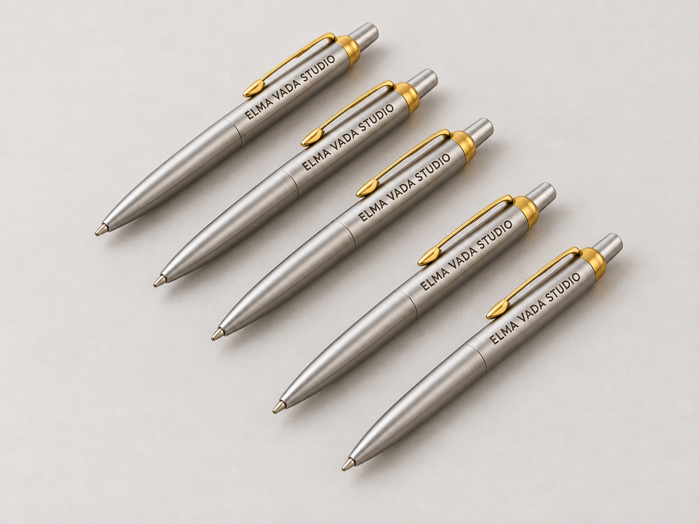

## 3. Personalized Drinkware

Два прозрачных стакана с матовой надписью ELMA VADA STUDIO. Концепт стеклянной посуды, не металлический tumbler; наличие модели уточните.

Файл: [clear-engraved-event-glasses-elma-vada-dfw.png](clear-engraved-event-glasses-elma-vada-dfw.png)  
Поле: `examples.item_2` · Основное.

Alt (79 символов): `Two tall clear glasses with heavy bases and frosted Elma Vada Studio lettering.`

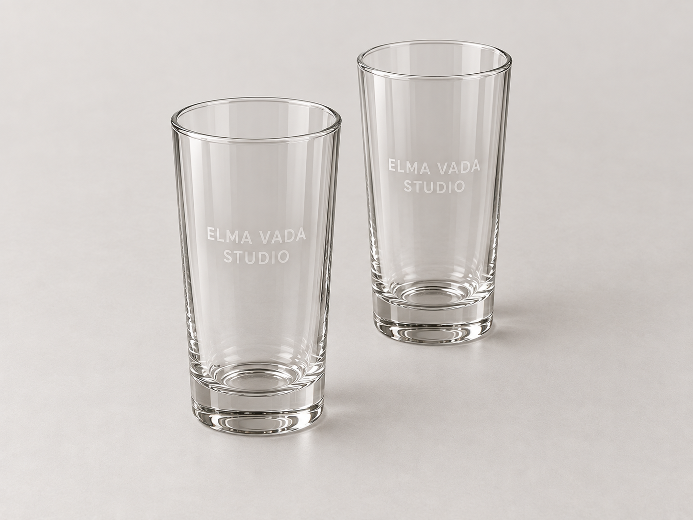

## 4. Personalized Keepsakes

Деревянный кубик ELMA VADA STUDIO и деревянный брелок THANK YOU.

Файл: [wooden-cube-keychain-keepsakes-elma-vada-dfw.png](wooden-cube-keychain-keepsakes-elma-vada-dfw.png)  
Поле: `examples.item_3` · Основное.

Alt (91 символов): `Wooden cube engraved Elma Vada Studio beside a wooden Thank You keychain with a metal ring.`

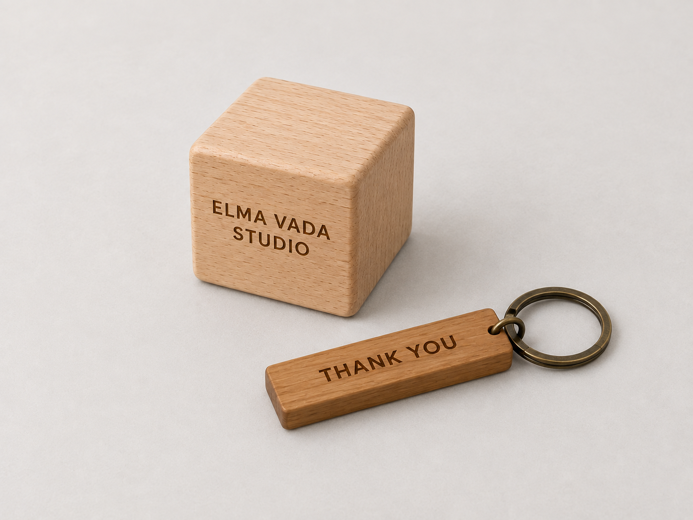

## 5. Event Packs

Подарочный пакет, коробка с серебристой ручкой, золотая лента и деревянный брелок WELCOME.

Файл: [engraved-pen-event-pack-gold-ribbon-elma-vada-dfw.png](engraved-pen-event-pack-gold-ribbon-elma-vada-dfw.png)  
Поле: `examples.item_4` · Основное.

Alt (94 символов): `Engraved silver pen in a black box with gold ribbon, a gift bag and a wooden Welcome keychain.`

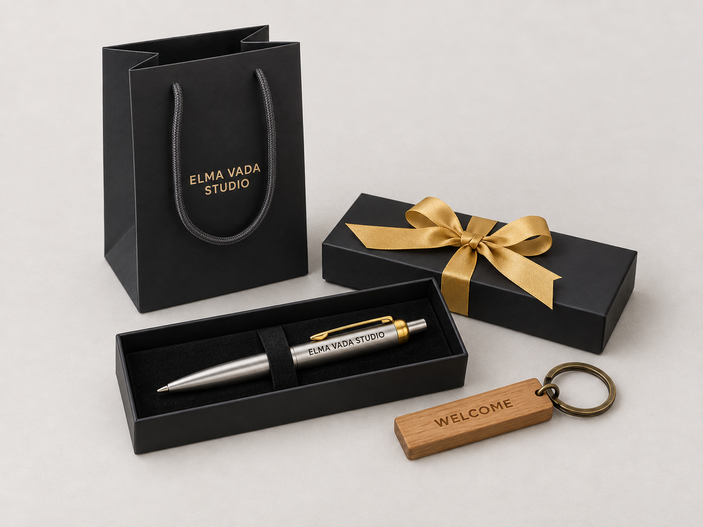

## 6. Share the Brief

Брелок и карточка брифа с полями Occasion, Audience, Quantity, Event date.

Файл: [event-gift-brief-wooden-keychain-elma-vada-dfw.png](event-gift-brief-wooden-keychain-elma-vada-dfw.png)  
Поле: `process.item_1` · Дополнительное, show_image выключен.

Alt (90 символов): `Wooden Elma Vada Studio keychain beside a blank event brief card with four labeled fields.`

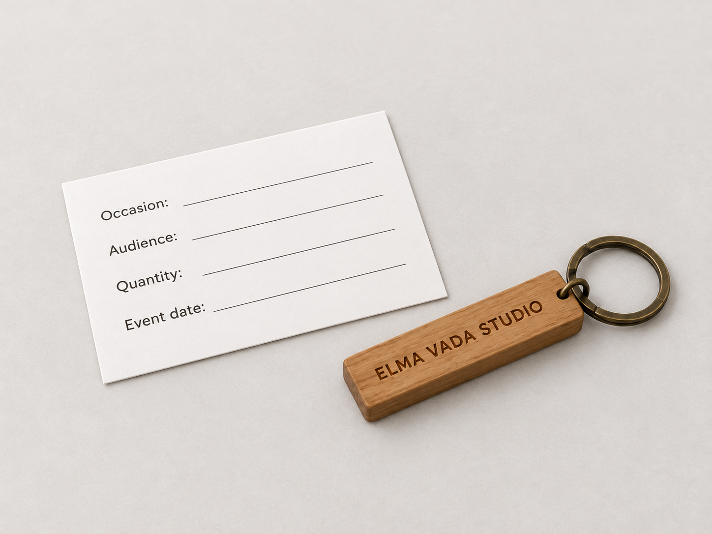

## 7. Review the Direction

Планшет с двумя вариантами шрифта на серебристой ручке и образец рядом.

Файл: [promotional-pen-design-options-elma-vada-dfw.png](promotional-pen-design-options-elma-vada-dfw.png)  
Поле: `process.item_2` · Дополнительное, show_image выключен.

Alt (90 символов): `Tablet showing two lettering options on silver pens beside a matching engraved sample pen.`

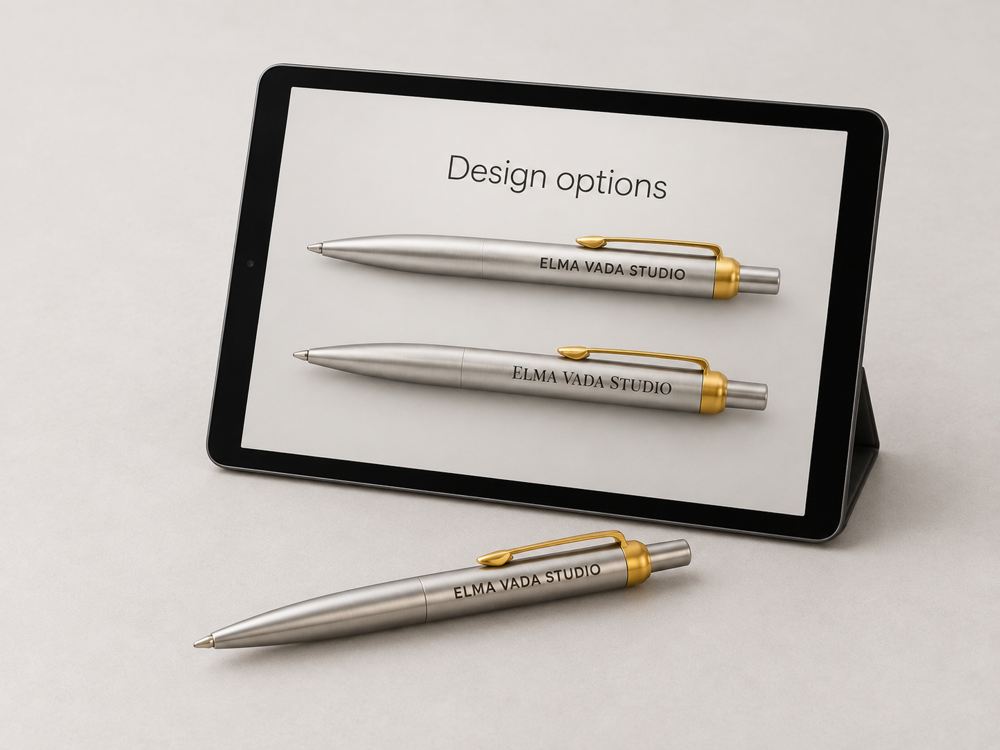

## 8. Approve the Details

Ручка и лист согласования: Artwork, Spelling, Quantity; направления размеров показаны без числовых значений.

Файл: [event-pen-engraving-approval-layout-elma-vada-dfw.png](event-pen-engraving-approval-layout-elma-vada-dfw.png)  
Поле: `process.item_3` · Дополнительное, show_image выключен.

Alt (96 символов): `Silver engraved pen beside an artwork proof with dimension guides and three approval checkboxes.`

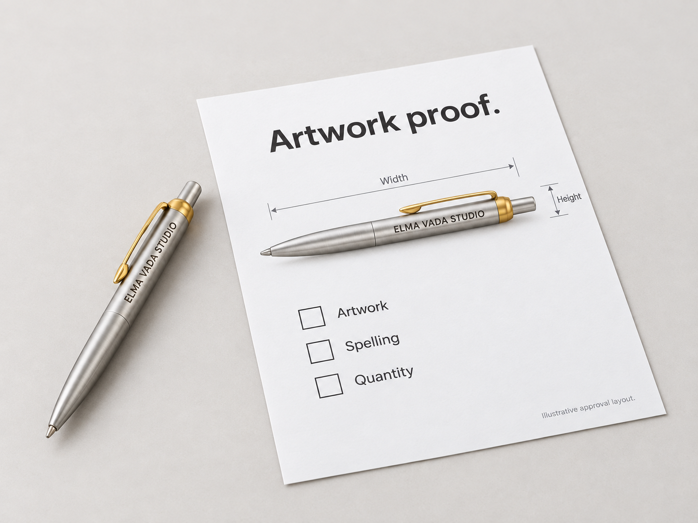

## 9. Produce & Prepare

Пять закрытых коробок с золотыми бантами и одна открытая коробка с ручкой. Визуальный концепт комплектации.

Файл: [ribboned-event-gift-box-batch-elma-vada-dfw.png](ribboned-event-gift-box-batch-elma-vada-dfw.png)  
Поле: `process.item_4` · Дополнительное, show_image выключен.

Alt (82 символов): `Five black boxes with gold bows behind an open box holding an engraved silver pen.`

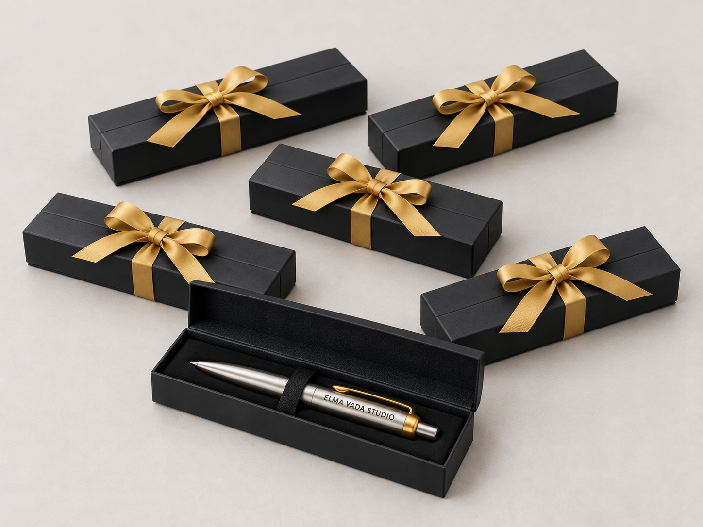

## 10. Business Solutions

Круглая прозрачная награда на деревянной опоре с надписями ELMA VADA STUDIO и THANK YOU.

Файл: [circular-appreciation-award-elma-vada-dfw.png](circular-appreciation-award-elma-vada-dfw.png)  
Поле: `related.item_1` · Дополнительное, show_image выключен.

Alt (88 символов): `Clear round award with Elma Vada Studio and Thank You lettering on a curved wooden base.`

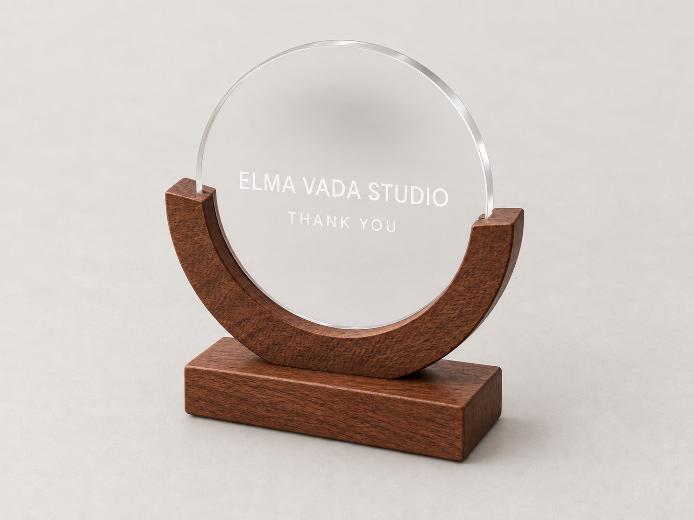

## 11. Production Capabilities

Иллюстрация настольного аппарата по фото оборудования вашей студии, на общем сером фоне. Тип лазера не заявлен.

Файл: [desktop-engraving-machine-display-elma-vada-dfw.png](desktop-engraving-machine-display-elma-vada-dfw.png)  
Поле: `related.item_2` · Дополнительное, show_image выключен.

Alt (100 символов): `Silver desktop laser engraving machine with a vertical column, black lens and perforated metal base.`

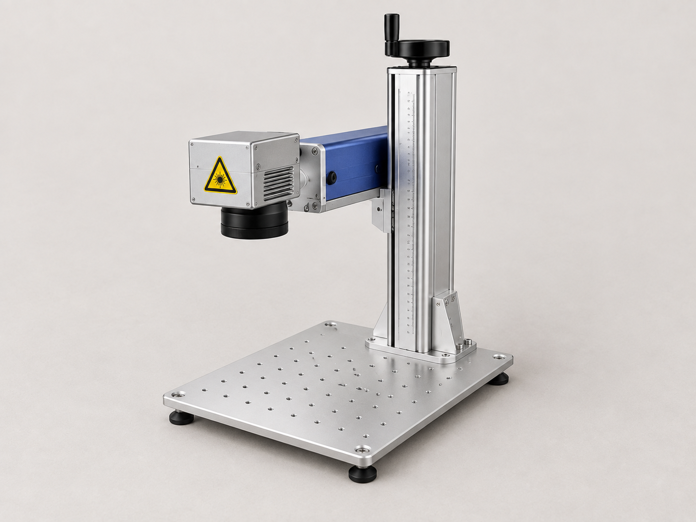

## 12. Our Work

Деревянные палочки THANK YOU в раздвижном футляре ELMA VADA STUDIO.

Файл: [wooden-chopstick-case-gift-elma-vada-dfw.png](wooden-chopstick-case-gift-elma-vada-dfw.png)  
Поле: `related.item_3` · Дополнительное, show_image выключен.

Alt (83 символов): `Wooden chopsticks engraved Thank You inside a sliding case marked Elma Vada Studio.`

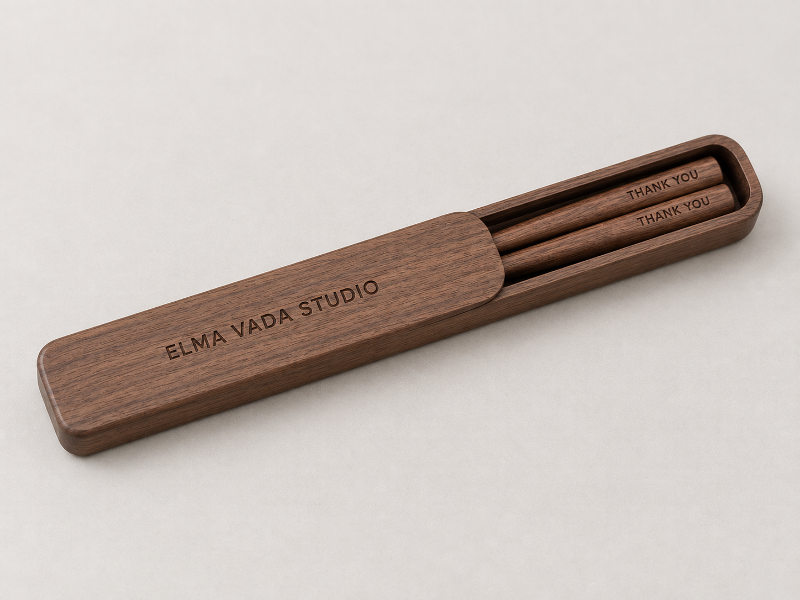

## Референсы и промпты

Продуктовые референсы: `../personalized-merchandise/sources/`: pen.png, keychain.png, cube.png, packaging.png, award.png, chopsticks.png, studio.png. Drinkware использует прежний иллюстративный drinkware-concept.png.
Фон всех новых кадров задан файлом Hero в этой папке. [Исходный промпт Hero](hero-image-notes.md).
В prompts.json сохранены промпты новых изображений, исходные рекомендации из инструкции и правка фона награды.

Названия файлов содержат elma-vada и dfw, только строчные латинские буквы и дефисы. DFW — контекст страницы, не утверждение о месте съёмки. Alt описывает только видимое, без набора SEO-ключей.
